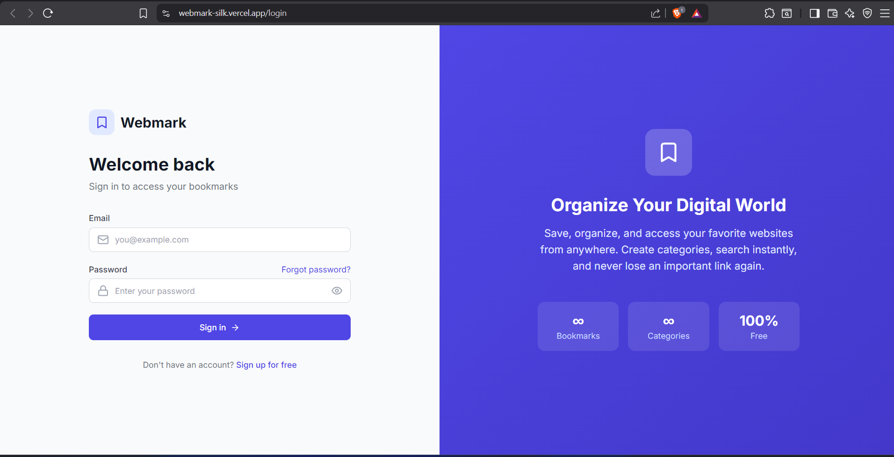
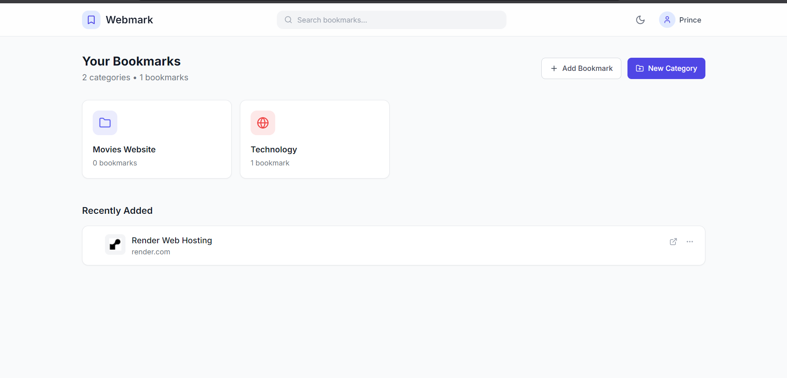

# Webmark - Personal Bookmark Manager

A modern, full-stack personal bookmark manager web application built with React, Node.js, Express, and MongoDB. Save and organize your favorite websites into categories with a beautiful, minimal UI inspired by tools like Notion and Linear.

## 📸 Screenshots

<div align="center">

### Login Page


### Dashboard


</div>

## ✨ Features

- **User Authentication**: Secure signup/login with JWT authentication
- **Category Management**: Create, edit, and delete bookmark categories
- **Bookmark Management**: Add, edit, delete bookmarks with automatic favicon fetching
- **Search**: Real-time search across all bookmarks
- **Dark Mode**: Toggle between light and dark themes
- **Responsive Design**: Works seamlessly on desktop and mobile
- **Modern UI**: Clean, minimal design with smooth animations

## Tech Stack

### Frontend
- React 18 with Vite
- React Router v6
- Tailwind CSS
- Lucide React (icons)
- Axios
- React Hot Toast

### Backend
- Node.js
- Express.js
- MongoDB with Mongoose
- JWT Authentication
- bcrypt.js
- Express Validator

## Prerequisites

Before running this project, make sure you have installed:

- [Node.js](https://nodejs.org/) (v18 or higher)
- [MongoDB](https://www.mongodb.com/try/download/community) (local installation or MongoDB Atlas)
- npm or yarn

## Project Structure

```
Webmark/
├── client/                 # React frontend
│   ├── public/
│   ├── src/
│   │   ├── components/     # Reusable UI components
│   │   ├── context/        # React context providers
│   │   ├── pages/          # Page components
│   │   ├── services/       # API services
│   │   ├── App.jsx
│   │   ├── main.jsx
│   │   └── index.css
│   ├── index.html
│   ├── package.json
│   ├── tailwind.config.js
│   └── vite.config.js
│
└── server/                 # Node.js backend
    ├── middleware/         # Express middleware
    ├── models/             # Mongoose models
    ├── routes/             # API routes
    ├── server.js
    ├── package.json
    └── .env.example
```

## Getting Started

### 1. Clone the repository

```bash
cd "d:\VIT - PROJECT\Webmark"
```

### 2. Setup Backend

```bash
# Navigate to server directory
cd server

# Install dependencies
npm install

# Create environment file
copy .env.example .env
```

Edit the `.env` file with your configuration:

```env
PORT=5000
MONGODB_URI=mongodb://localhost:27017/webmark
JWT_SECRET=your_super_secret_jwt_key_here_change_in_production
JWT_EXPIRES_IN=7d
```

**Important**: Change the `JWT_SECRET` to a secure random string in production!

### 3. Setup Frontend

```bash
# Navigate to client directory (from project root)
cd client

# Install dependencies
npm install
```

### 4. Start MongoDB

If using local MongoDB:
```bash
# Windows
mongod
```

Or use [MongoDB Atlas](https://www.mongodb.com/atlas) for a cloud database.

### 5. Run the Application

**Terminal 1 - Start Backend:**
```bash
cd server
npm run dev
```

The server will start at `http://localhost:5000`

**Terminal 2 - Start Frontend:**
```bash
cd client
npm run dev
```

The app will be available at `http://localhost:5173`

## API Endpoints

### Authentication
| Method | Endpoint | Description |
|--------|----------|-------------|
| POST | `/api/auth/register` | Register new user |
| POST | `/api/auth/login` | Login user |
| GET | `/api/auth/me` | Get current user |

### Categories
| Method | Endpoint | Description |
|--------|----------|-------------|
| GET | `/api/categories` | Get all categories |
| GET | `/api/categories/:id` | Get single category |
| POST | `/api/categories` | Create category |
| PUT | `/api/categories/:id` | Update category |
| DELETE | `/api/categories/:id` | Delete category |

### Bookmarks
| Method | Endpoint | Description |
|--------|----------|-------------|
| GET | `/api/bookmarks` | Get all bookmarks (with search) |
| GET | `/api/bookmarks/recent` | Get recent bookmarks |
| GET | `/api/bookmarks/category/:id` | Get bookmarks by category |
| POST | `/api/bookmarks` | Create bookmark |
| PUT | `/api/bookmarks/:id` | Update bookmark |
| DELETE | `/api/bookmarks/:id` | Delete bookmark |

## Database Models

### User
```javascript
{
  name: String,
  email: String (unique),
  password: String (hashed),
  createdAt: Date
}
```

### Category
```javascript
{
  userId: ObjectId,
  name: String,
  icon: String,
  color: String,
  createdAt: Date
}
```

### Bookmark
```javascript
{
  userId: ObjectId,
  categoryId: ObjectId,
  title: String,
  url: String,
  description: String,
  favicon: String,
  order: Number,
  createdAt: Date
}
```

## Features Overview

### Authentication
- Secure user registration and login
- Password hashing with bcrypt (12 salt rounds)
- JWT tokens for session management
- Protected routes on frontend and backend

### Dashboard
- Grid view of all categories as cards
- Category card shows name, icon, and bookmark count
- Recently added bookmarks section
- Empty state for new users

### Category Management
- Create categories with custom name, icon, and color
- Edit category details
- Delete category (also deletes all bookmarks inside)
- 16 icon options, 12 color options

### Bookmark Management
- Add bookmarks with title, URL, and description
- Automatic favicon fetching using Google's favicon service
- Edit and delete bookmarks
- Move bookmarks between categories
- Open bookmark in new tab

### Search
- Real-time search from navbar
- Search by title, URL, or description
- Search results displayed with category info

### Dark Mode
- System preference detection
- Manual toggle
- Persisted in localStorage

## UI Components

- **Navbar**: Logo, search bar, dark mode toggle, user menu
- **CategoryCard**: Displays category with hover effects
- **BookmarkCard**: Shows bookmark with favicon, edit/delete options
- **AddCategoryModal**: Form to create/edit categories
- **AddBookmarkModal**: Form to add/edit bookmarks
- **ConfirmModal**: Confirmation dialog for destructive actions
- **EmptyState**: Friendly message when no data exists
- **LoadingSpinner**: Loading indicator
- **Skeleton**: Loading placeholder animations

## Scripts

### Backend
```bash
npm start       # Start production server
npm run dev     # Start development server with nodemon
```

### Frontend
```bash
npm run dev     # Start development server
npm run build   # Build for production
npm run preview # Preview production build
```

## Environment Variables

### Backend (.env)
| Variable | Description | Default |
|----------|-------------|---------|
| PORT | Server port | 5000 |
| MONGODB_URI | MongoDB connection string | mongodb://localhost:27017/webmark |
| JWT_SECRET | Secret for JWT signing | - |
| JWT_EXPIRES_IN | Token expiry | 7d |
| CLIENT_URL | Frontend URL for CORS | http://localhost:5173 |

### Frontend
| Variable | Description | Default |
|----------|-------------|---------|
| VITE_API_URL | Backend API URL | /api |

## Production Deployment

### Backend
1. Set `NODE_ENV=production`
2. Use a strong `JWT_SECRET`
3. Use MongoDB Atlas or managed database
4. Deploy to platforms like Railway, Render, or Heroku

### Frontend
1. Build the app: `npm run build`
2. Deploy `dist` folder to Vercel, Netlify, or similar
3. Set `VITE_API_URL` to your backend URL

## Contributing

1. Fork the repository
2. Create your feature branch (`git checkout -b feature/AmazingFeature`)
3. Commit your changes (`git commit -m 'Add some AmazingFeature'`)
4. Push to the branch (`git push origin feature/AmazingFeature`)
5. Open a Pull Request

## Acknowledgments

- Design inspired by [Notion](https://notion.so), [Linear](https://linear.app), and [Raycast](https://raycast.com)
- Icons by [Lucide](https://lucide.dev)
- Favicon service by Google

---

## 🤝 Connect

<div align="center">

| Platform | Link |
|---|---|
| 📸 Instagram | [@itsprincepratap](https://www.instagram.com/itsprincepratap) |
| 🐙 GitHub | [@theprincepratap](https://github.com/theprincepratap) |
| 💼 LinkedIn | [thprincepratap](https://www.linkedin.com/in/thprincepratap/) |

</div>

---

## 💛 Support

If this project helped you, consider buying me a coffee:

**[💰 PayPal — paypal.me/theprincepratap](https://www.paypal.com/paypalme/theprincepratap)**

---

## 📄 License

MIT © Prince Pratap

---

Built with ❤️ for organizing the web
